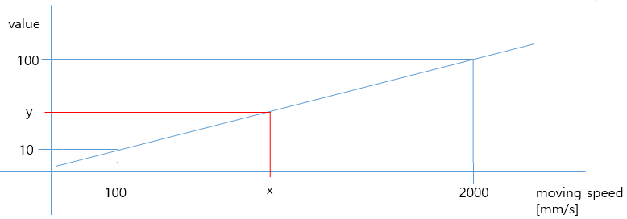

# 10.1.12 speed_out문

speed_out문은 로봇의 현재 이동속도에 비례하는 값을 계산한 후 지정한 변수에 대입하는 프로시져입니다. <br>
보간이 L이나 C로 지정된 move문을 실행하는 동안에만 동작합니다. 

### 설명

로봇이 현재 이동하는 속도에 비례하는 값을 계산한 후 이 결과값을 지정된 변수에 대입합니다. <br>
하기의 명령문이 수행되었다면 그림과 같이 현재 로봇의 이동속도 x에 대응하는 y의 값을 계산해서 dow10에 대입합니다. <br>
... <br>
speed_out on,min_spd=100,max_spd=2000,min_val=10,max_val=100,var=dow10 <br>



### 문법

```python
speed_out <on/off>,min_spd=<최소속도>,max_spd=<최대속도>,min_val=<최소값>,max_val=<최대값>,var=<산술변수>
```

### 파라미터

<table>
  <thead>
    <tr>
      <th style="text-align:left">항목</th>
      <th style="text-align:left">의미</th>
      <th style="text-align:left">기타</th>
    </tr>
  </thead>
  <tbody>
  <tr>
      <td style="text-align:left">on/off</td>
      <td style="text-align:left">
      실행할 구간을 지정
      </td>
      <td style="text-align:left"></td>
    </tr>
  </tbody>
  <tbody>
  <tr>
      <td style="text-align:left">min_spd</td>
      <td style="text-align:left">
      로봇 이동 최소 속도를 지정 [mm/s]
      </td>
      <td style="text-align:left"></td>
    </tr>
  </tbody>
  <tbody>
  <tr>
      <td style="text-align:left">max_spd</td>
      <td style="text-align:left">
      로봇 이동 최대 속도를 지정 [mm/s]
      </td>
      <td style="text-align:left"></td>
    </tr>
  </tbody>
  <tbody>
  <tr>
      <td style="text-align:left">min_val</td>
      <td style="text-align:left">
      로봇 이동 최소 속도에 대응하는 값을 지정
      </td>
      <td style="text-align:left"></td>
    </tr>
  </tbody>
  <tbody>
  <tr>
      <td style="text-align:left">max_val</td>
      <td style="text-align:left">
      로봇 이동 최대 속도에 대응하는 값을 지정
      </td>
      <td style="text-align:left"></td>
    </tr>
  </tbody>
  <tbody>
  <tr>
      <td style="text-align:left">var</td>
      <td style="text-align:left">
      계산된 값을 저장할 변수를 지정
      </td>
      <td style="text-align:left"> 산술변수</td>
    </tr>
  </tbody>
</table>

### 사용 예

```python
   move P,spd=30%,accu=0,tool=1
   speed_out on,min_spd=100,max_spd=2000,min_val=10,max_val=100,var=dow10
   move L,spd=30mm/s,accu=0,tool=1
   move L,spd=30mm/s,accu=0,tool=1
   speed_out off
   move P,spd=30%,accu=0,tool=1
   end
```
