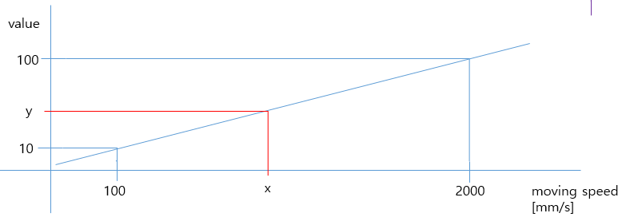

# 10.1.12 `speed_out` Statement

The `speed_out` statement is a procedure that calculates a value proportional to the robot's current movement speed and assigns the result to a specified variable.  
It operates only while executing a `move` statement with interpolation set to `L` or `C`.

### Description

This statement calculates a value proportional to the robot's current moving speed and stores the calculated result in the specified variable.  

If the following command is executed, as shown in the figure, the value `y` corresponding to the current robot speed `x` is calculated and assigned to dow10.
...  
```python
speed_out on,min_spd=100,max_spd=2000,min_val=10,max_val=100,var=dow10
```



### Syntax
```python
speed_out <on/off>, min_spd=<minimum speed>, max_spd=<maximum speed>, min_val=<minimum value>, max_val=<maximum value>, var=<numeric variable>
```

### Parameters
| Item    | Description                                                    | Remarks          |
| ------- | -------------------------------------------------------------- | ---------------- |
| on/off  | Specifies the section in which the function is enabled         |                  |
| min_spd | Specifies the minimum robot movement speed [mm/s]              |                  |
| max_spd | Specifies the maximum robot movement speed [mm/s]              |                  |
| min_val | Specifies the value corresponding to the minimum robot speed   |                  |
| max_val | Specifies the value corresponding to the maximum robot speed   |                  |
| var     | Specifies the variable in which the calculated value is stored | Numeric variable |

### Example

```python
   move P,spd=30%,accu=0,tool=1
   speed_out on,min_spd=100,max_spd=2000,min_val=10,max_val=100,var=dow10
   move L,spd=30mm/s,accu=0,tool=1
   move L,spd=30mm/s,accu=0,tool=1
   speed_out off
   move P,spd=30%,accu=0,tool=1
   end
```
