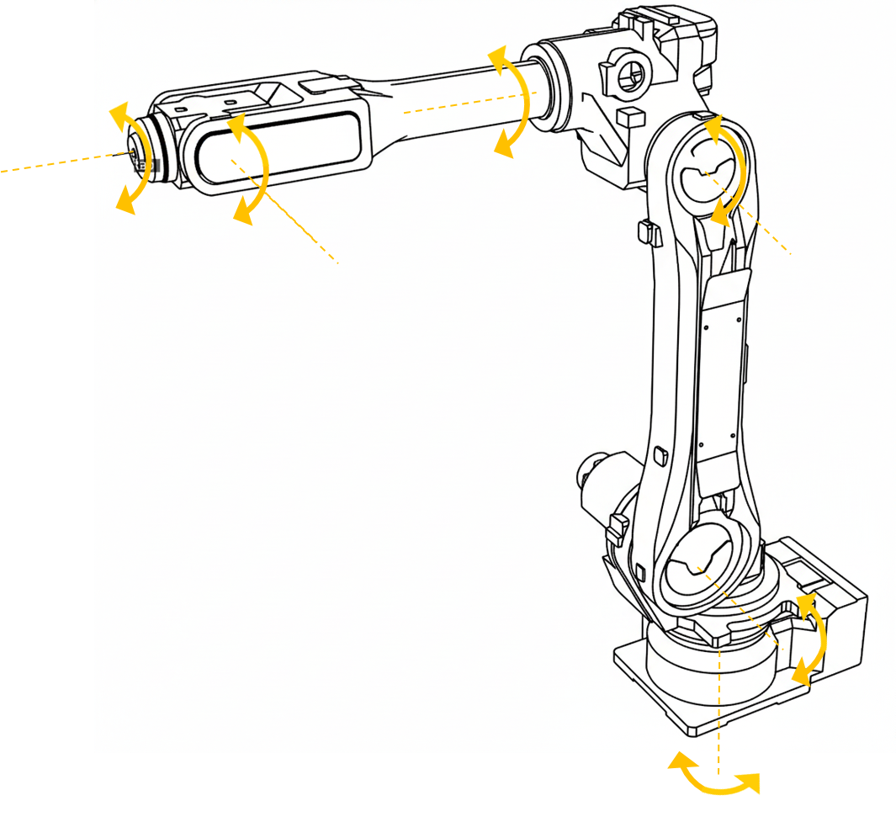
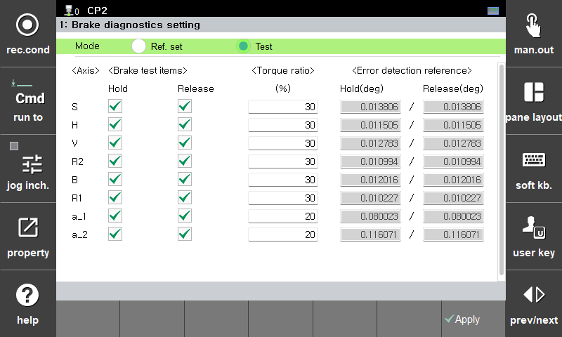

# 10.1.16 brake_check문

brake_check문은 각 축별 모터에 토크를 적용하여 브레이크가 정상 동작하는지 진단하기 위한 프로시져 입니다.

### 설명



* **Hold 테스트**  
브레이크가 체결된 상태에서 축별로 3초간 토크를 적용하는 동안 모터 각도의 변화량이 기준치 이하인지 검사합니다. 

* **Release 테스트**  
브레이크가 해제된 상태에서 축별로 3초간 토크를 적용하는 동안 모터 각도의 변화량이 기준치 이상인지 검사합니다.

### 문법

```python
brake_check  
brake_check os=<에러출력신호> 
brake_check job=<복귀 프로그램>
brake_check os=<에러출력신호>,job=<복귀 프로그램>
```

### 파라미터

<table>
  <thead>
    <tr>
      <th style="text-align:left">항목</th>
      <th style="text-align:left">의미</th>
      <th style="text-align:left">기타</th>
    </tr>
  </thead>
  <tbody>
  <tr>
      <td style="text-align:left">에러 출력 신호</td>
      <td style="text-align:left">
         각도 변화량이 기준값을 벗어날 경우 출력할 신호<br>
         - 지정 시 경고가 발생하고 신호가 출력됨<br>
         - 미지정 시 에러가 발생함
      </td>
      <td style="text-align:left">변수</td>
    </tr>
    <tr>
      <td style="text-align:left">복귀 프로그램</td>
      <td style="text-align:left">
        각도 변화량이 기준값을 벗어날 경우 수행할 프로그램 번호
      </td>
      <td style="text-align:left">변수</td>
    </tr>
  </tbody>
</table>

### 설정 항목
brake_check 명령어에서 [속성] 버튼을 터치하면 브레이크 검사 관련 설정 화면에 진입합니다.  


- **모드**  
  기준값 설정 모드와 진단 모드 수행 여부를 설정할 수 있습니다.  

- **시험 항목**  
축별로 Hold, Release 테스트 수행 여부를 설정할 수 있습니다.  

- **토크 적용 비율(%)**  
축별로 토크를 얼마나 적용시킬지 설정할 수 있습니다.  

- **에러 감지 기준**  
진단 모드에서 수행 시 축별로 에러를 감지할 기준 각도를 설정할 수 있습니다. 
기준값 설정 모드로 수행 시 자동 설정됩니다.  
엔지니어 권한 이상에서만 수정 가능합니다.

### 에러 가이드
- E1509 : 브레이크 검사가 6초 이내에 완료되지 않은 경우 발생합니다.
- E1510 : 브레이크 해제가 되지 않은 경우 발생합니다.
- E1525 ~ E1527 : 복귀 프로그램이 없거나 구성이 다른 경우 발생합니다.
- E1529 : 로봇 이동 중, 독립 실행 중 등으로 브레이크 검사 불가한 상태인 경우 발생합니다.
- E1530 :  브레이크 검사 실행이 지연된 경우 발생합니다.
- E21005/W21005 : Hold 검사 시 각도 변화량이 Release 검사 시 각도 변화량보다 큰 경우 발생합니다.


### 사용 예

```python
   var v0
   move P,spd=50%,accu=3,tool=1
   brake_check os=do50,job=9000    # 에러 발생 시 do50 출력 및 9000번 작업 프로그램 수행
   end
```


* 제품 동작 중에는 작동 범위 내에 들어가거나 로봇을 만지지 마십시오. 상해의 위험이 있습니다.



