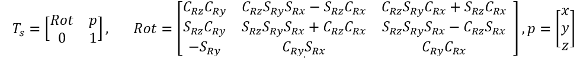
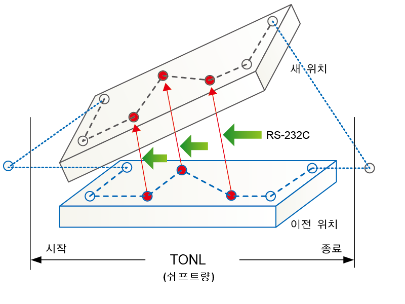

# 10.1.2 tonl문

tonl문은 시작과 종료 사이의 스텝들에 대해 위치보정을 수행하기 위한 프로시져입니다.

### 설명

좌표 변환 관계를 알고있는 경우, 별도의 좌표변환 관계 계산없이 변환관계를 입력하는 경우에 적용하는 기능입니다.  

R=[x,y,z,rx,ry,rz]



자세 행렬의 경우 Rot_z.Rot_y.Rot_x의 순서로 적용됩니다.

### 문법

```python
tonl <시작/종료>,<시프트량>
```

### 파라미터

<table>
  <thead>
    <tr>
      <th style="text-align:left">항목</th>
      <th style="text-align:left">의미</th>
      <th style="text-align:left">기타</th>
    </tr>
  </thead>
  <tbody>
  <tr>
      <td style="text-align:left">시작/종료</td>
      <td style="text-align:left">
        온라인 좌표변환 시작/종료<br>
        <ul>
        <li>on: 시작</li>
        <li>off: 종료</li>
        </ul>
      </td>
      <td style="text-align:left">on/off</td>
    </tr>
    <tr>
      <td style="text-align:left">시프트량</td>
      <td style="text-align:left">
        시프트할 양
      </td>
      <td style="text-align:left">시프트변수</td>
    </tr>
  </tbody>
</table>

### 사용 예

```python
   global sft
   enet1.recv msg # 이더넷 통신으로 시프트량 수신
   sft=Shift(msg)
   tonl on,sft
   move L,spd=50mm/s,accu=0,tool=1
   move L,spd=10mm/s,accu=0,tool=1
   move L,spd=50mm/s,accu=0,tool=1
   tonl off
```



