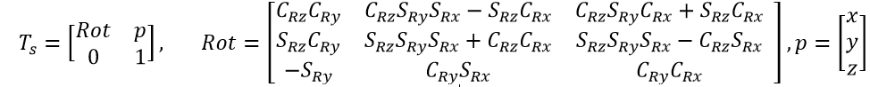
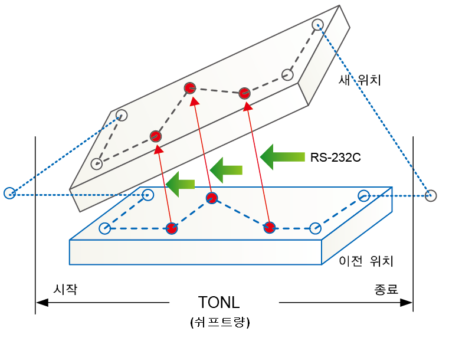

# 10.1.2 `tonl`

`tonl` 语句是在开始和结束之间执行位置修正的过程。

### 描述

如果您知道坐标变换关系，当您输入变换关系而不计算单独的坐标变换关系时，将应用此过程。

```python
R=[x,y,z,rx,ry,rz]
```



对于旋转矩阵，它按 Rot_z.Rot_y.Rot_x 的顺序应用。

### 语法

```python
tonl <start/end>,<shift>
```

### 参数

<table>
  <thead>
    <tr>
      <th style="text-align:left">参数</th>
      <th style="text-align:left">描述</th>
      <th style="text-align:left">备注</th>
    </tr>
  </thead>
  <tbody>
  <tr>
      <td style="text-align:left">start/end</td>
      <td style="text-align:left">
        在线变换开始/结束<br>
        <ul>
        <li>on: 开始</li>
        <li>off: 结束</li>
        </ul>
      </td>
      <td style="text-align:left">开/关</td>
    </tr>
    <tr>
      <td style="text-align:left">shift</td>
      <td style="text-align:left">
        移动量
      </td>
      <td style="text-align:left">移动表达式</td>
    </tr>
  </tbody>
</table>

### 示例

```python
   global sft
   enet1.recv msg # 通过以太网接收移动量
   sft=Shift(msg)
   tonl on,sft
   move L,spd=50mm/s,accu=0,tool=1
   move L,spd=10mm/s,accu=0,tool=1
   move L,spd=50mm/s,accu=0,tool=1
   tonl off
```

