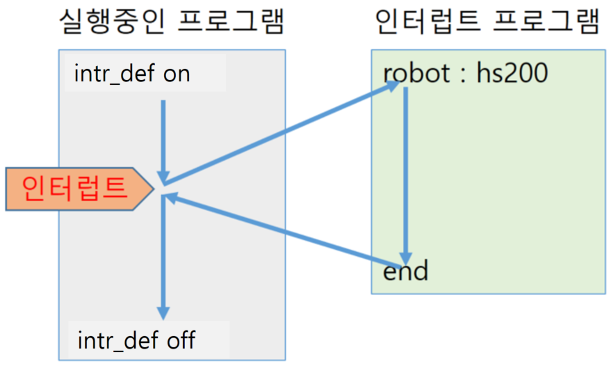

# 10.1.5 `intr_def`

`intr_def` 是一个定义中断条件、观察间隔和中断发生时运行的程序的过程。

### 语法

中断功能是一种程序调用。当机器人在中断观察间隔内工作时，它会在满足预定义的中断条件时调用指定的任务。当被调用的程序完成运行后，它会返回到之前运行的程序的位置并继续运行。



### 简介

- 仅在中断观察间隔内操作。
- 支持算术表达式作为中断条件表达式。
- 在执行中断程序时允许其他中断处理（多个中断）。

### 中断被清除的时间点

如果发生以下操作，所有定义的中断会自动清除。

- 执行 'R0: 任务重置' 时
- 程序首次运行时
- 在更改程序计数器（步骤/功能 #）后启动时

### 示例

```python
intr_def <on/off>,no=<interrupt number>,var=<interrupt condition>,val=<condition matching value>,job=<call program number>,[once]
```

### 参数

<table>
  <thead>
    <tr>
      <th style="text-align:left">参数</th>
      <th style="text-align:left">描述</th>
      <th style="text-align:left">备注</th>
    </tr>
  </thead>
  <tbody>
  <tr>
      <td style="text-align:left">on/off</td>
      <td style="text-align:left">
        定义中断或删除已定义的中断<br>
        <ul>
        <li>on: 定义一个新的中断。</li>
        <li>off: 删除已定义的中断。（忽略第3个及后续参数。）</li>
        </ul>
      </td>
      <td style="text-align:left">on/off</td>
    </tr>
    <tr>
      <td style="text-align:left">中断编号</td>
      <td style="text-align:left">
        要定义或删除的中断编号。<br>
      </td>
      <td style="text-align:left">算术表达式</td>
    </tr>
    <tr>
      <td style="text-align:left">中断条件</td>
      <td style="text-align:left">
        导致中断的条件表达式。
      </td>
      <td style="text-align:left">变量</td>
    </tr>
    <tr>
      <td style="text-align:left">条件匹配值</td>
      <td style="text-align:left">
        生成中断的条件表达式的值。
      </td>
      <td style="text-align:left">算术表达式</td>
    </tr>
    <tr>
      <td style="text-align:left">调用程序编号</td>
      <td style="text-align:left">
        中断发生时要调用的程序编号。
      </td>
      <td style="text-align:left">算术表达式</td>
    </tr>
    <tr>
      <td style="text-align:left">[once]</td>
      <td style="text-align:left">
        在中断观察间隔中仅处理一次中断，而不处理额外的中断。
      </td>
      <td style="text-align:left">once</td>
    </tr>
  </tbody>
</table>

### 错误

- E1351 : 当不删除就重新定义已经定义的中断编号时发生。请检查创建的程序。

### 示例

```python
   intr_def on,no=1,var=di5,val=1,job=24,once # 定义中断
   move P,spd=30%,accu=3,tool=1
   move L,spd=30mm/s,accu=3,tool=1
   ...
   move L,spd=30mm/s,accu=3,tool=1
   move P,spd=30%,accu=3,tool=1
   intr_def off,no=1 # 删除中断
   move P,spd=30%,accu=3,tool=1
   end
```