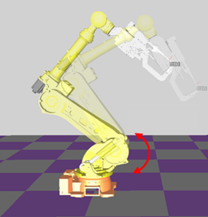

# 10.1.7 gasp_check문

gasp_check문은 로봇에 장착된 가스스프링의 압력을 추정하여 정상 범위에 있는지 확인합니다.

### 설명



- 압력을 추정하기 위해 가스스프링이 장착된 축을 현재 위치에서 -20도만큼 왕복 운전합니다.
- 추정된 압력을 변수에 저장하여 모니터링할 수 있습니다.
- 사용자가 정상 압력과 오차 허용 범위를 입력할 수 있습니다. 추정 압력이 범위를 초과한 경우 설정한 신호를 출력할 수 있습니다.

### 문법

```python
gasp_check pres=<추정 압력>,ref=<기준 압력>,tol=<허용오차>
gasp_check pres=<추정 압력>,ref=<기준 압력>,tol=<허용오차>,os=<에러출력신호>
```

### 파라미터

<table>
  <thead>
    <tr>
      <th style="text-align:left">항목</th>
      <th style="text-align:left">의미</th>
      <th style="text-align:left">기타</th>
    </tr>
  </thead>
  <tbody>
  <tr>
      <td style="text-align:left">추정 압력</td>
      <td style="text-align:left">
         추정된 가스스프링 압력이 저장되는 변수[bar]
      </td>
      <td style="text-align:left">변수</td>
    </tr>
    <tr>
      <td style="text-align:left">기준 압력</td>
      <td style="text-align:left">
        에러 발생 기준이 될 정상 압력[bar]
      </td>
      <td style="text-align:left">변수</td>
    </tr>
    <tr>
      <td style="text-align:left">허용오차</td>
      <td style="text-align:left">
      기준 압력 대비 허용할 오차[bar]
      </td>
      <td style="text-align:left">변수</td>
    </tr>
    <tr>
      <td style="text-align:left">에러출력신호</td>
      <td style="text-align:left">
        에러가 발생한 경우 출력시킬 신호
      </td>
      <td style="text-align:left">출력변수</td>
    </tr>
  </tbody>
</table>

### 에러 가이드
- E21011 : 추정된 가스스프링 압력이 최소 에러 기준보다 낮을 경우 발생합니다.
- E21012 : 추정된 가스스프링 압력이 최대 에러 기준보다 높을 경우 발생합니다.
- E21013 : 가스스프링 검사 기능을 지원하지 않는 로봇인 경우 발생합니다.


### 사용 예

```python
   var v0
   move P,spd=50%,accu=3,tool=1
   gasp_check pres=v0,ref=120,tol=20,os=do50    # 측정 압력이 100 ~ 140 bar인 경우 정상
   end
```


* 가스스프링이 장착된 로봇에서만 지원되는 기능입니다.
* 정확한 추정을 위해 기능 사용 전 [축별 부가중량 설정](https://hrbook-hrc.web.app/#/view/doc-hi6-operation/korean-tp630/7-system/4-robot-parameter/7-axis-add-weight/README) 및 [부하추정 기능](https://hrbook-hrc.web.app/#/view/doc-hi6-operation/korean-tp630/7-system/7-auto-calibration/3-load-estimation)이 선행되어야 합니다.

