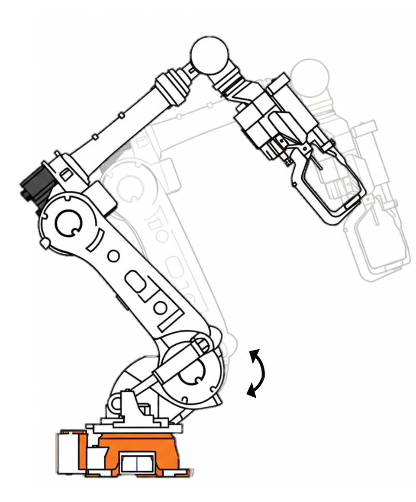

# 10.1.7 `gasp_check`

`gasp_check`语句估计安装在机器人上的气体弹簧的压力，并检查其是否正常。

### 描述



- 为了估计压力，配备气体弹簧的轴从其当前位置往回移动-20度。（建议在H轴140度位置执行）
- 通过将估计压力保存为变量来监测压力。
- 用户可以输入正常压力和容差。如果估计压力超过范围，设置的错误输出信号将开启。

### 语法

```python
gasp_check pres=<estimated pressure>,ref=<reference pressure>,tol=<tolerance>
gasp_check pres=<estimated pressure>,ref=<reference pressure>,tol=<tolerance>,os=<error output signal>
```

### 参数

<table>
  <thead>
    <tr>
      <th style="text-align:left">参数</th>
      <th style="text-align:left">描述</th>
      <th style="text-align:left">备注</th>
    </tr>
  </thead>
  <tbody>
  <tr>
      <td style="text-align:left">estimated pressure</td>
      <td style="text-align:left">
         存储估计气体弹簧压力的变量[bar]
      </td>
      <td style="text-align:left">变量</td>
    </tr>
    <tr>
      <td style="text-align:left">normal pressure</td>
      <td style="text-align:left">
        作为错误发生的参考值的正常压力[bar]
      </td>
      <td style="text-align:left">变量</td>
    </tr>
    <tr>
      <td style="text-align:left">tolerance</td>
      <td style="text-align:left">
        估计压力误差容差[bar]
      </td>
      <td style="text-align:left">变量</td>
    </tr>
    <tr>
      <td style="text-align:left">错误输出信号</td>
      <td style="text-align:left">
        当发生错误时的信号输出
      </td>
      <td style="text-align:left">输出信号变量</td>
    </tr>
  </tbody>
</table>

### 错误
- E21011 : 当估计的气弹簧压力低于最低错误标准时发生。
- E21012 : 当估计的气弹簧压力高于最高错误参考时发生。
- E21013 : 在不支持气弹簧压力检查的机器人上发生。


### 示例

   var v0
   move P,spd=50%,accu=3,tool=1
   gasp_check pres=v0,ref=120,tol=20,os=do50    # 如果估计压力在100到140 bar之间，则为正常
   end


* 产品运行时，请勿进入操作区域或触摸机器人。 有受伤的风险。



* 仅在配备气弹簧的机器人上支持
* 为了准确估计，必须在使用该功能之前进行[轴添加重量设置](https://hrbook-hrc.web.app/#/view/doc-hi6-operation/zh-tp630/7-system/4-robot-parameter/7-axis-add-weight/README?cont_model=${cont_model})和[负载估计功能](https://hrbook-hrc.web.app/#/view/doc-hi6-operation/zh-tp630/7-system/7-auto-calibration/3-load-estimation?cont_model=${cont_model})。
* 有关气弹簧压力检查监控功能的详细说明，请参阅以下链接。
[](https://hrbook-hrc.web.app/#/view/doc-hi6-operation/zh-tp630/6-monitoring/4-system/2-system-diagnosis/2-gas-pressure-check?cont_model=${cont_model})
* 估计的气弹簧压力可能会因测量开始时的初始姿势而有所变化。在机器人的初始设置期间，请根据每个参考姿势进行的测量管理压力值，并定期在同一姿势下测量压力，以便将其与初始值进行比较。如果在测量值中观察到显著差异，请检查设备的状态。

