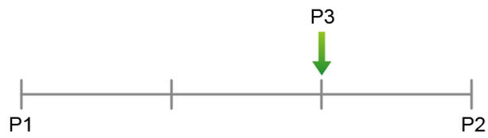
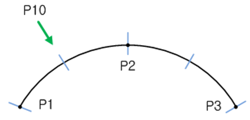

# 10.2.2 `segment`

`segment` 是将起始位置和结束位置之间的距离均匀划分的函数。

### 描述

将函数因子之间的距离均匀划分，并根据指定计数器存储与位置和姿态相关的姿态值到姿态变量中。


例如，如果 `P3=segment(P1,P2,3,2)`，将 `P1` 起始位置到 `P2` 目标位置之间的距离划分为 3 个相等部分，并将第 2 个姿态的位姿和旋转值存储到 `P3` 姿态变量中。

当你将途经位置作为函数的参数添加时，由起始位置、途经点和目标位置组成的弧上的距离被均匀划分，位姿和旋转的姿态值被存储在姿态变量中。



例如，如果 `P10=segment (P1,P2,P3,4,2)`，则由 `P1` 起始姿态和 `P2` 途经姿态 `P3` 目标姿态组成的弧上的距离被划分为 4 个相等部分，指定的第 2 个姿态的位姿和旋转值被存储到 `P10` 姿态变量中。

<br>

### 语法

```python
result=segment(<start pose>,<end pose>,<division number>,<counter>)
```

```python
result=segment(<start pose>,<via pose>,<end pose>,<division number>,<counter>)
```

### 返回值

结果姿态。

### 参数
<table>
  <thead>
    <tr>
      <th style="text-align:left">参数</th>
      <th style="text-align:left">描述</th>
      <th style="text-align:left">备注</th>
    </tr>
  </thead>
  <tbody>
    <tr>
      <td style="text-align:left">start pose</td>
      <td style="text-align:left">
        起始姿态
      </td>
      <td style="text-align:left">姿态表达</td>
    </tr>
    <tr>
      <td style="text-align:left">via pose</td>
      <td style="text-align:left">
        途经姿态
      <td style="text-align:left">姿态表达</td>
    </tr>
    <tr>
      <td style="text-align:left">end pose</td>
      <td style="text-align:left">
        结束姿态
      </td>
      <td style="text-align:left">姿态表达</td>
    </tr>
    <tr>
      <td style="text-align:left">division number</td>
      <td style="text-align:left">
        划分数量<br>
        (1 ~ 30000)
      </td>
      <td style="text-align:left">算术表达</td>
    </tr>
    <tr>
      <td style="text-align:left">counter</td>
      <td style="text-align:left">
        要存储的姿态计数器编号<br>
        (0 ~ 300000, 0: 起始姿态)
      </td>
      <td style="text-align:left">算术表达</td>
    </tr>
  </tbody>
</table>

### 示例

```python
     var po1,po2,po3
     po1=Pose(1000.000,0.000,1938.000,0.000,0.000,0.000) # 起始姿态
     po2=Pose(2000.000,0.000,1938.000,0.000,0.000,0.000) # 结束姿态
     po3=segment(po1,po2,4,2)
     end
```

```python
     var po1,po2,po3,po10
     po1=Pose(1000.000,0.000,1938.000,0.000,0.000,0.000) # 起始姿态
     po2=Pose(1500.000,500.000,1938.000,0.000,0.000,0.000) # 途经姿态
     po3=Pose(2000.000,0.000,1938.000,0.000,0.000,0.000) # 结束姿态
     po10=segment(po1,po2,po3,5,3)
     end
```