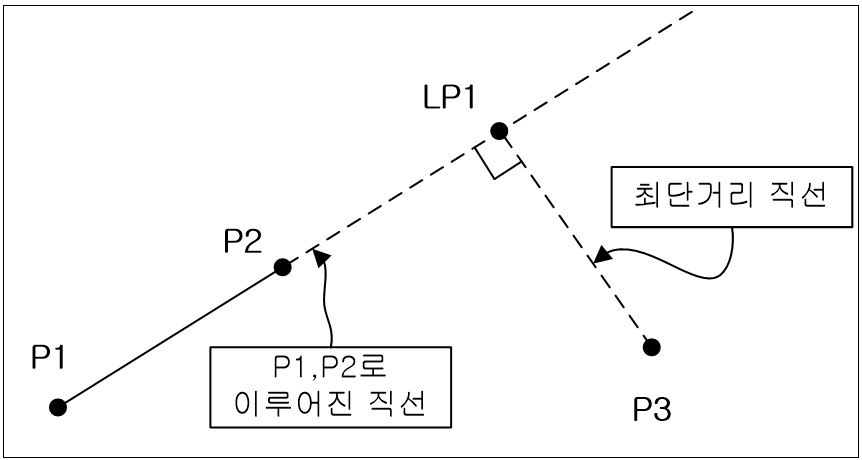
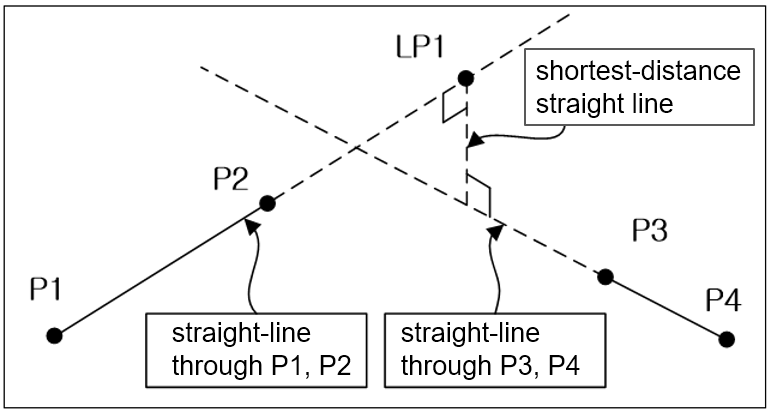

# 10.2.3 intersection 함수

intersection 함수를 사용하면 직선과 한 점의 최단거리로 만나는 점을 구하거나, 두 직선을 지나는 최단거리 직선과의 교점을 구할 수 있습니다.

### 설명

함수 인자에 직선을 이루는 두 점과 그 외의 한 점을 지정하면, 직선과 한 점을 최단거리로 연결하는 직선의 교차포즈를 구합니다.



함수 인자에 직선을 이루는 두 점과 다른 직선을 이루는 두 점을 지정하면, 두 직선을 최단거리로 만나는 직선과의 교점을 구할 수 있습니다. 교점은 첫번째로 지정한 직선과의 만나는 점입니다.



### 문법

```python
result=intersection(<직선참조포즈 1>,<직선참조포즈 2>,<위치참조포즈>)
```

```python
result=intersection(<직선참조포즈 1>,<직선참조포즈 2>,<직선참조포즈 3>,<직선참조포즈 4>)
```

### 파라미터
<table>
  <thead>
    <tr>
      <th style="text-align:left">항목</th>
      <th style="text-align:left">의미</th>
      <th style="text-align:left">기타</th>
    </tr>
  </thead>
  <tbody>
    <tr>
      <td style="text-align:left">직선참조포즈 1</td>
      <td style="text-align:left">
        첫번째 직선을 얻기 위한 첫번째 참조포즈
      </td>
      <td style="text-align:left">포즈변수</td>
    </tr>
    <tr>
      <td style="text-align:left">직선참조포즈 2</td>
      <td style="text-align:left">
        첫번째 직선을 얻기 위한 두번째 참조포즈
      <td style="text-align:left">포즈변수</td>
    </tr>
    <tr>
      <td style="text-align:left">위치참조포즈</td>
      <td style="text-align:left">
        직선과 최단거리 위치를 구하기 위해 참조하는 포즈
      </td>
      <td style="text-align:left">포즈변수</td>
    </tr>
    <tr>
      <td style="text-align:left">직선참조포즈 3</td>
      <td style="text-align:left">
        두번째 직선을 얻기 위한 첫번째 참조포즈
      </td>
      <td style="text-align:left">포즈변수</td>
    </tr>
    <tr>
      <td style="text-align:left">직선참조포즈 4</td>
      <td style="text-align:left">
        두번째 직선을 얻기 위한 두번째 참조포즈
      </td>
      <td style="text-align:left">포즈변수</td>
    </tr>
  </tbody>
</table>

### 사용 예

```python
     var po1,po2,po3,result
     po1=Pose(1000.000,0.000,1938.000,0.000,0.000,0.000)
     po2=Pose(2000.000,0.000,1938.000,0.000,0.000,0.000)
     po3=Pose(2500.000,500.000,1938.000,0.000,0.000,0.000)
     result=segment(po1,po2,po3)
     end
```

```python
     var po1,po2,po3,po4,result
     po1=Pose(1000.000,0.000,1938.000,0.000,0.000,0.000)
     po2=Pose(1500.000,500.000,1938.000,0.000,0.000,0.000)
     po3=Pose(2000.000,0.000,2000.000,0.000,0.000,0.000)
     po3=Pose(2000.000,0.000,2000.000,0.000,0.000,0.000)
     result=segment(po1,po2,po3,po4)
     end
```