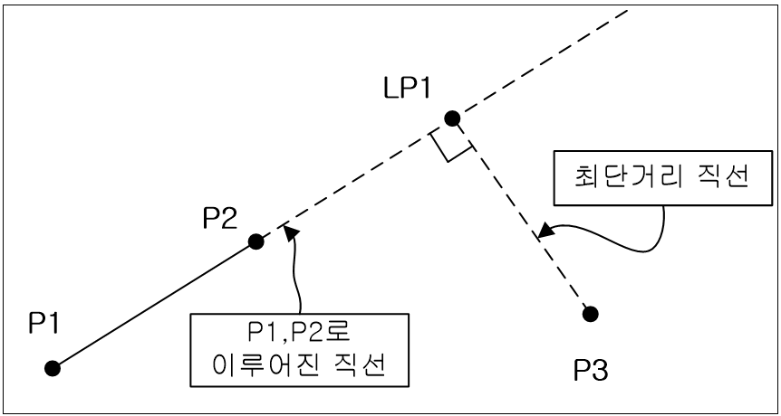
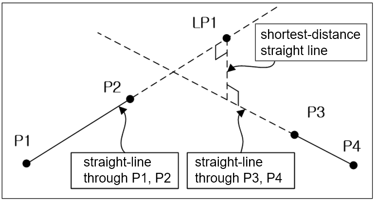

# 10.2.3 `intersection`

您可以使用 `intersection` 函数找到与直线相交的点，该点与直线的最短距离为一个点，或者找到与直线相交的最短距离。

### 描述

如果您指定两个形成直线的点和另一个点作为参数，您将获得一条连接直线和一个点的交叉位置，该交叉位置为最短距离。



如果您指定两个形成直线的点和两个形成另一条直线的点作为参数，您可以找到两条直线之间的最短距离的交点。交点是您指定的第一条直线的交点。




### 语法

```python
result=intersection(<straight-line ref.pose 1>,<straight-line ref.pose 2>,<position ref.pose>)
```

```python
result=intersection(<straight-line ref.pose 1>,<straight-line ref.pose 2>,<straight-line ref.pose 3>,<straight-line ref.pose 4>)
```

### 返回值

结果姿态。


### 参数
<table>
  <thead>
    <tr>
      <th style="text-align:left">参数</th>
      <th style="text-align:left">描述</th>
      <th style="text-align:left">备注</th>
    </tr>
  </thead>
  <tbody>
    <tr>
      <td style="text-align:left">straight-line ref.pose 1</td>
      <td style="text-align:left">
        第一条直线的第一个参考姿态
      </td>
      <td style="text-align:left">姿态表达</td>
    </tr>
    <tr>
      <td style="text-align:left">straight-line ref.pose 2</td>
      <td style="text-align:left">
2nd reference pose of 1st straight-line  
      <td style="text-align:left">位姿表达</td>  
    </tr>  
    <tr>  
      <td style="text-align:left">位置参考位姿</td>  
      <td style="text-align:left">  
        引用位姿以找到一条直线和最短距离位置  
      </td>  
      <td style="text-align:left">位姿表达</td>  
    </tr>  
    <tr>  
      <td style="text-align:left">直线参考位姿 3</td>  
      <td style="text-align:left">  
        2nd 直线的第 1 个参考位姿  
      </td>  
      <td style="text-align:left">位姿表达</td>  
    </tr>  
    <tr>  
      <td style="text-align:left">直线参考位姿 4</td>  
      <td style="text-align:left">  
        2nd 直线的第 2 个参考位姿  
      </td>  
      <td style="text-align:left">位姿表达</td>  
    </tr>  
  </tbody>  
</table>  

### 示例  