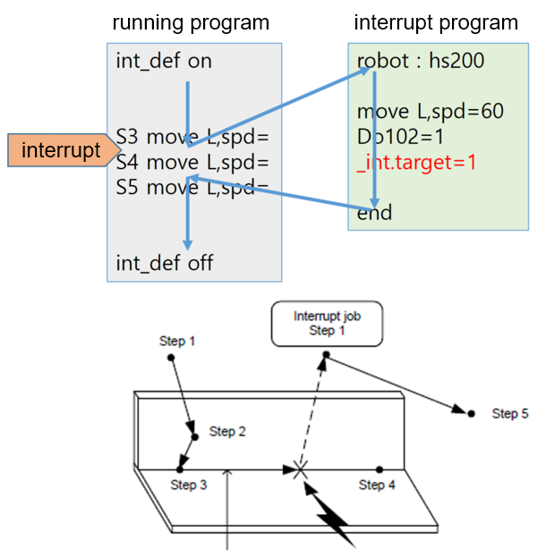

# 9.1.2 _int.target

`_int.target` system variable adjusts the robot's target position reach state.


### Description

In the move statement, this is used to adjust the position when the an interrupt occurs while moving and returns to the position of the previous program after the execution of the call program ends.


### Syntax

```python
_int_target=1
```

### Sample

```python
- _int.target=-1
```


```python
- _int.target=1 or 0
```


