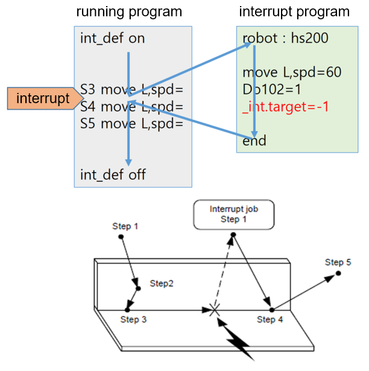
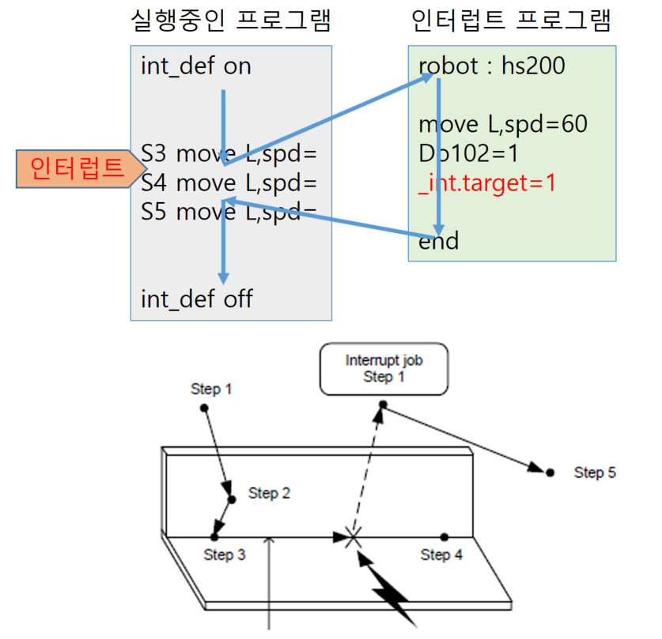

# 9.1.2 _intr.target문

_intr.target 시스템 변수는 로봇의 목표위치 도달 상태를 조정합니다.

### 설명

move문에서 로봇이 이동중에 인터럽트가 발생하여 호출 프로그램의 실행이 종료된 후 이전 실행하던 프로그램의 위치로 되돌아 올 때 이 위치를 조정하기 위해서 사용합니다.   


### 문법

```python
_intr_target=1
```

### 사용 예

```python
- _intr.target=-1
```




```python
- _intr.target=1 or 0
```


