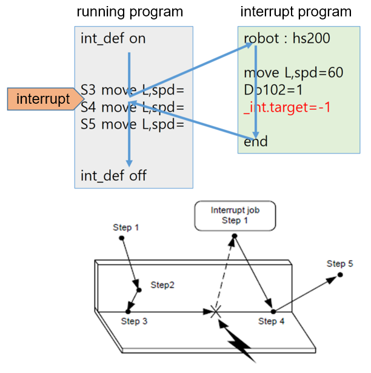
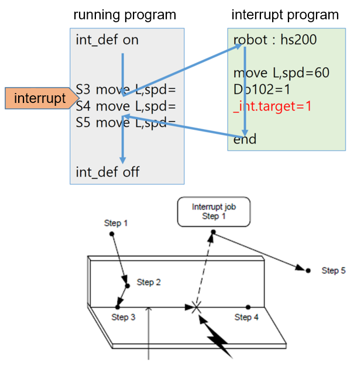

# `_intr.target`

`_intr.target` 系统变量调整机器人的目标位置到达状态。


### Description

在移动语句中，这用于在移动时发生中断时调整位置，并在调用程序执行结束后返回到上一个程序的位置。


### Syntax

```python
_intr_target=1
```

### Sample

```python
- _intr.target=-1
```




```python
- _intr.target=1 or 0
```
