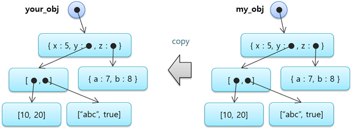

# 4.3 数组和对象的复制赋值

如果赋值语句的右侧包含对象变量，则右侧变量的整个值将被复制到左侧的变量。 当数组或对象以复杂的方式将子数组和子对象包含为元素值时，这种包含结构将被复制，这称为深复制。

<table>
  <thead>
    <tr>
      <th style="text-align:left"></th>
      <th style="text-align:left"></th>
    </tr>
  </thead>
  <tbody>
    <tr>
      <td style="text-align:left">0001.job</td>
      <td style="text-align:left">
        
var my_obj = { x:5, y:0, z:0 }
           
        

        
my_obj.y=[ [10, 20], [&quot;abc&quot;, true] ]
           
        

        
my_obj.z={ a:7, b:8 }
           
        

        
var your_obj=my_obj # deep copy
           
        

        
print your_obj.y[0]
           
        

      </td>
    </tr>
    <tr>
      <td style="text-align:left">结果</td>
      <td style="text-align:left">[10, 20]</td>
    </tr>
  </tbody>
</table>

