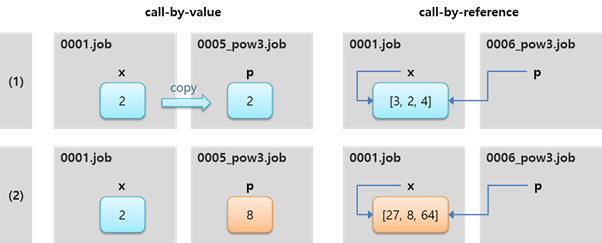

# 4.4 通过引用调用和通过值调用

在第3.4节中给出的`call`语句和`jump`语句的描述中，解释了形式参数和实际参数的概念。当实际参数被传送到子程序时，如果子程序在更改参数的值后结束，这种更改会反映到主程序中吗？

例如，假设一个子程序`0005_pow3.job`将一个值提升到三次方，如下所示：

<table>
  <thead>
    <tr>
      <th style="text-align:left"></th>
      <th style="text-align:left"></th>
    </tr>
  </thead>
  <tbody>
    <tr>
      <td style="text-align:left">0001.job</td>
      <td style="text-align:left">
        
var x=2
           
        

        
call 0005_pow3,x
           
        

        
print x
           
        

        
end
           
        

      </td>
    </tr>
    <tr>
      <td style="text-align:left">0005_pow3.job</td>
      <td style="text-align:left">
        
param p
           
        

        
var t=p
           
        

        
p=t*t*t # (1)
           
        

        
end
           
        

      </td>
    </tr>
<tr>
      <td style="text-align:left">结果</td>
      <td style="text-align:left">2</td>
    </tr>
  </tbody>
</table>

虽然我们预期输出为8，因为2x2x2是8，但结果是2。这是因为，当数字类型的实际参数传输到子程序时，值会作为参数被复制。换句话说，在\(1\)中，因为赋值给复制版本的是三次方的值，所以没有影响到原参数x的值。

因此，教学程序应该进行修正，以便通过返回语句传输结果值。

<table>
  <thead>
    <tr>
      <th style="text-align:left"></th>
      <th style="text-align:left"></th>
    </tr>
  </thead>
  <tbody>
    <tr>
      <td style="text-align:left">0001.job</td>
      <td style="text-align:left">
        
var x=2
           
        

        
call 0005_pow3,x
           
        

        
x=result()
           
        

        
print x
           
        

        
end
           
        

      </td>
    </tr>
    <tr>
      <td style="text-align:left">0005_pow3.job</td>
      <td style="text-align:left">
        
param p
           
        

        
var t=p
           
        

p=t*t*t
           
        

        
返回 p
           
        

      </td>
    </tr>
    <tr>
      <td style="text-align:left">结果</td>
      <td style="text-align:left">8</td>
    </tr>
  </tbody>
</table>

另一方面，对于数组或对象，将传递实际参数的引用，而不是复制的版本。引用指的是参数的位置。

在以下示例中，子程序 0006\_pow3.job 将数组的每个元素提高到三次方，实际参数数组的元素值会发生变化。

<table>
  <thead>
    <tr>
      <th style="text-align:left"></th>
      <th style="text-align:left"></th>
    </tr>
  </thead>
  <tbody>
    <tr>
      <td style="text-align:left">0001.job</td>
      <td style="text-align:left">
        
var x=[3, 2, 4]
           
        

        
调用 0006_pow3,x
           
        

        
打印 x
           
        

        
结束
           
        

      </td>
    </tr>
    <tr>
      <td style="text-align:left">0006_pow3.job</td>
      <td style="text-align:left">
        
param p
           
        

        
变量 t
           
        

        
对于 i=0 到 len(arr)-1
           
        

        
t=p[i]
           
        

        
p[i] = t*t*t
           
        

        
下一个
           
        

        
结束
           
        

      </td>
    </tr>
    <tr>
      <td style="text-align:left">结果</td>
      <td style="text-align:left">[27, 8, 64]</td>
    </tr>
  </tbody>
</table>

当调用子程序时，如果实际参数的复制值被传输，则称为按值调用；如果传输的是引用，则称为按引用调用。是否为按值调用或按引用调用由以下的值类型决定：

|  |  |
| :--- | :--- |
| 按值调用 | 布尔值、数字和字符串类型 |
| 按引用调用 | 数组和对象类型 |

