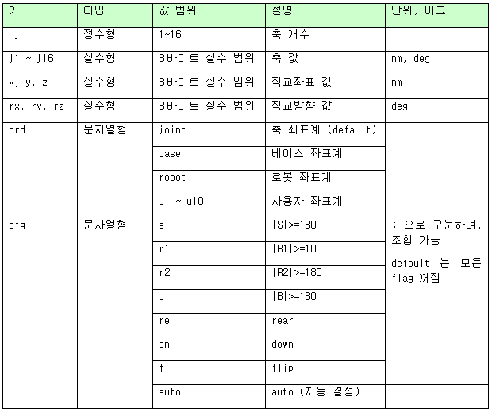

# 5.1 포즈 \(pose\)

포즈는 ${cont_model} 제어기에 기본 내장된 객체형으로서, 로봇의 각 축의 자세, 혹은 툴 끝의 직교좌표와 방향을 표현합니다.

포즈는 생성자 함수 Pose\( \)를 호출하여 생성합니다. 함수 매개변수들은 모두 위치 매개변수입니다. 첫 번째 문자열 요소는 format으로 두 번째 문자열 요소는 config로 인식됩니다. 나머지는 모두 숫자형입니다.

### format (포맷)
좌표계를 포함한 여러 서브 요소들이 세미콜론 (;)으로 구분 열거됩니다. 각 서브 요소는 생략 가능하며 순서에 무관하게 인식됩니다.
<table>
  <tr>
    <th>서브 요소명</th>
    <th>타입</th>
    <th>설명</th>
  </tr>
  <tr>
    <td>crd</td>
    <td>문자열</td>
    <td>좌표계 (coordinate system).<br>생략하면 축(joint) 좌표<br> 아래 표 참조</td>
  </tr>
  <tr>
    <td>sync(p1,p2)</td>
    <td>p1, p2는 실수</td>
    <td>센서 동기 (1~2개의 위치 값)</td>
  </tr>
  <tr>
    <td>mi(mech 번호[, ...])</td>
    <td>각 mech번호는 0~7의 정수</td>
    <td>메커니즘 구성<br>(mi는 mech.info.을 줄임말)<br>생략하면 전체 메커니즘</td>
  </tr>
</table>

format의 예 (examples);
```python
"base,mi(0,2)" # base 좌표계, 메커니즘 0번+2번으로 구성
"" # 좌표계 생략 (joint 좌표계), 센서 동기 없음, 메커니즘 생략 (전체 메커니즘)
"sync(20.5,-12.0),robot" #센서 동기(1번 위치=20.5, 2번 위치=-12.0), robot 좌표계
```

### config


cfg요소는 로봇 자세 \(configuration\)를 지정합니다.<br>
축 좌표(joint)의 경우는 필요 없고, 직교좌표의 경우만 필요합니다.<br>
자세한 내용은 Hi6 로봇제어기 조작설명서의 "[2.3.2.2 베이스 및 로봇 기록 좌표](https://hrbook-hrc.web.app/#/view/doc-hi6-operation/korean-tp630/2-operation/3-step/2-step-pose-modify/2-base-robot-crd-sys)"를 참조하십시오.




### 변수 정의 예제

```python
var 포즈변수명 = Pose(j1, j2, j3, …)					# 축 좌표
var 포즈변수명 = Pose(x, y, z, rx, ry, rz, j7, j8,…, format, cfg)		# base 좌표
```

6축+부가1축, 직교+부가 1축, 부가 1축 단독의 포즈를 생성하는 아래의 예를 참고하십시오.

```python
var po1 = Pose(10, 90, 0, 0, -30, 0, -1240.8)		# 좌표계 생략 (축 좌표)
var po2 = Pose(1850, 0, 2010.5, 0, -90, 0, -1240.8, "base", "fl;r2")	# base 좌표
var po3 = Pose(-1140.8, "mi(2)")	# 축 좌표, 메커니즘 2번
```

혹은, 1개의 배열 혹은 문자열 매개변수로도 Pose 생성자 함수를 호출할 수 있습니다. 이를 활용해, 파일이나 원격통신으로 얻은 데이터를 포즈로 변환해 사용할 수 있습니다.

```python
var 포즈변수명 = Pose(array)
var 포즈변수명 = Pose(string)
```

아래의 예를 참고하십시오.

```python
var arr = [10, 90, 0, 0, -30, 0, -1240.8]
var str = "[1850, 0, 2010.5, 0, -90, 0, -1240.8, \"base\", \"fl;r2\"]"
var po3 = Pose(arr)
var po4 = Pose(str)
```

Pose 객체의 요소들은 다음의 키들로 접근 가능합니다.

<!---->

<table>
  <tr>
    <th>키</th>
    <th>타입</th>
    <th>값 범위</th>
    <th>설명</th>
    <th>단위, 예, 비고</th>
  </tr>
    <tr>
    <td>nj</td>
    <td>정수형</td>
    <td>1~32</td>
    <td>축 개수</td>
    <td> </td>
  </tr>
   </tr>
    <tr>
    <td>j1~j32</td>
    <td>실수형</td>
    <td>8 바이트 실수 범위</td>
    <td>축 값</td>
    <td>mm, deg</td>
  </tr>
   </tr>
    <tr>
    <td>x, y, z</td>
    <td>실수형</td>
    <td>8 바이트 실수 범위</td>
    <td>직교좌표 값</td>
    <td>mm</td>
  </tr>
   </tr>
    <tr>
    <td>rx, ry, rz</td>
    <td>실수형</td>
    <td>8 바이트 실수 범위</td>
    <td>좌표계 방향 오일러 각도</td>
    <td>deg</td>
  </tr>
  <tr>
    <td rowspan="4">crd</td>
    <td rowspan="4">문자열형</td>
    <td>joint</td>
    <td>축 좌표계 (default)</td>
    <td rowspan="4"></td>
  </tr>
  <tr>
    <td>base</td>
    <td>베이스 좌표계</td>
  </tr>
  <tr>
    <td>robot</td>
    <td>로봇 좌표계</td>
  </tr>
  <tr>
    <td>u1 ~ u10</td>
    <td>사용자 좌표계</td>
  </tr>
  <tr>
    <td rowspan="8">cfg</td>
    <td rowspan="8">문자열형</td>
    <td>s</td>
    <td>|S|>=180</td>
    <td rowspan="7">; 으로 구분하여,<br> 조합가능 <br> default 는 모든 flag 꺼짐.</td>
  </tr>
  <tr>
    <td>r1</td>
    <td>|R1|>=180</td>
  </tr>
  <tr>
    <td>r2</td>
    <td>|R2|>=180</td>
  </tr>
  <tr>
    <td>b</td>
    <td>|B|>=180</td>
  </tr>
  <tr>
    <td>re</td>
    <td>rear</td>
  </tr>
  <tr>
    <td>dn</td>
    <td>down</td>
  </tr>
  <tr>
    <td>nf</td>
    <td>non-flip</td>
  </tr>
  <tr>
    <td>auto</td>
    <td>auto (자동 결정)</td>
    <td></td>
  </tr>
  <tr>
    <td>mechinfo</td>
    <td>정수형</td>
    <td>-1 ~ 255</td>
    <td>bitfield<br>(bit0:M0, bit1:M1, .... bit7:M7)<br>-1이면 전체 메커니즘.</td>
    <td>포함된 메커니즘의 bit만 1</td>
  </tr>
  <tr>
    <td>nsync</td>
    <td>정수형</td>
    <td>0~2</td>
    <td>센서 동기 개수</td>
    <td></td>
  </tr>
  <tr>
    <td>sync</td>
    <td>문자열형 (p1, p2는 실수)</td>
    <td>sync(p1,p2)</td>
    <td>센서 동기 값</td>
    <td>sync(220.5,195.3)</td>
  </tr>
</table>


아래의 예와 같이 포즈 요소값에 접근할 수 있습니다.

```python
po1.j2 = po1.j2 + 5
print po2.z, po2.cfg
```


