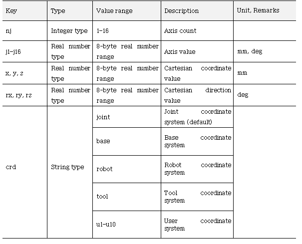

# 5.2 Shift

Shift 是嵌入在 ${cont_model} 控制器中的对象类型，表示姿态的变化值。

Shift 通过调用构造函数 `Shift()` 创建。所有函数参数均为位置参数。同时，`crd` 和 `cfg` 为字符串类型，其余为数字类型。

```python
var <shift variable name> = Shift(j1, j2, j3, ...)				# 轴坐标
var <shift variable name> = Shift(x, y, z, rx, ry, rz, j7, j8,..., crd)		# 基坐标
```

参考以下创建 6 轴 + 1 额外轴和笛卡尔 + 1 额外轴的 Shift 示例。

```python
var sft1 = Shift(30, 0, 0, 0, -5.8, 0, -120)				# 轴坐标
var sft2 = Shift(0, 0, 55.2, 0, -5, 0, -120, "base")			# 基坐标
```

或者，可以使用单个数组或字符串参数调用构造函数 Shift。通过此方式，可以将文件或数据转换为 Shift，通过远程通信获取并使用。

```python
var <shift variable name> = Shift(array)
var <shift variable name> = Shift(string)
```

参考以下示例。

```python
var arr = [30, 0, 0, 0, -5.8, 0, -120]
var str = "[0, 0, 55.2, 0, -5, 0, -120, \"base\"]"
var sft3 = Shift(arr)
var sft4 = Shift(str)
```

可以使用以下键访问 Shift 对象的元素。

