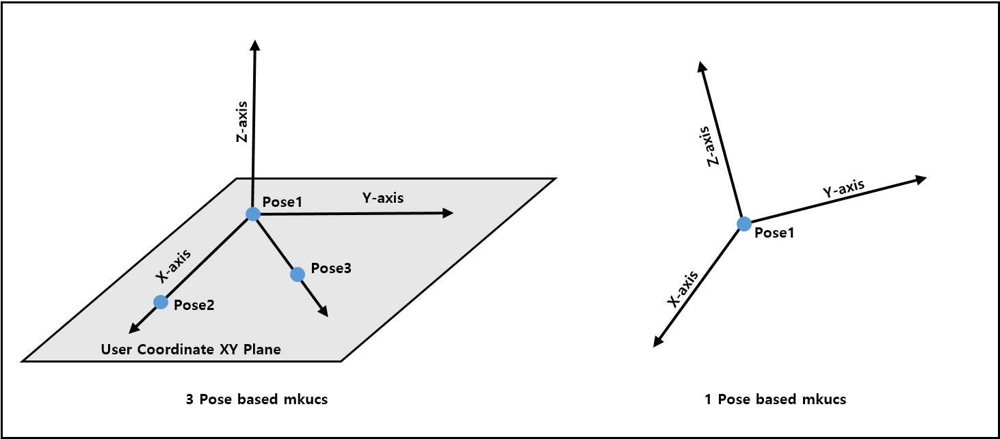

# 5.5 `mkucs` - 制作用户坐标系

### 描述

一个用来创建具有三个姿态或一个姿态的用户坐标系的命令。

- 当您用三个姿态创建时，它会根据指定的步骤顺序创建原点姿态、轴姿态和平面姿态。
- 如果未指定步骤顺序，它将使用原点姿态、X轴姿态和XY平面姿态创建。
- 当您用一个姿态创建时，它将使用原点姿态，并且位置/方向基于姿态值。
- 如果无法计算，作业执行将因错误中断。

### 语法

```python
<result variable> = mkucs(<user coord. system number>,<step order>,<origin pose>,<axis pose>,<plane pose>)
or
<result variable> = mkucs(<user coord. system number>,<origin pose>)
```

### 参数

<table>
  <thead>
    <tr>
      <th style="text-align:left">参数</th>
      <th style="text-align:left">描述</th>
      <th style="text-align:left">备注</th>
    </tr>
  </thead>
  <tbody>
  <tr>
      <td style="text-align:left">result variable</td>
      <td style="text-align:left">
        后台执行的结果<br>
        <ul>
        <li>0: 成功完成。</li>
        <li>-1: 创建用户坐标系统失败。</li>
        </ul>
      </td>
      <td style="text-align:left">变量</td>
    </tr>
    <tr>
      <td style="text-align:left">user coord. system number</td>
      <td style="text-align:left">
        要创建的用户坐标系统的编号
      </td>
      <td style="text-align:left">[1~20]</td>
    </tr>
    <tr>
      <td style="text-align:left">step order</td>
      <td style="text-align:left">
        三个姿态的顺序，如果未指定，将为"OXY" <br>
        (示例) <br>
        "OXY" : 原点姿态，X轴姿态，XY平面姿态 <br>
        "OYZ" : 原点姿态，Y轴姿态，YZ平面姿态 <br>
      </td>
      <td style="text-align:left">字符串变量</td>
    </tr>
    <tr>
      <td style="text-align:left">origin pose</td>
      <td style="text-align:left">
        原点处的姿态
      </td>
      <td style="text-align:left">姿态变量</td>
    </tr>
    <tr>
      <td style="text-align:left">axis pose</td>
      <td style="text-align:left">
        位于X、Y、Z轴上的姿态
      </td>
      <td style="text-align:left">姿态变量</td>
    </tr>
    <tr>
      <td style="text-align:left">plane pose</td>
      <td style="text-align:left">
        位于XY、YZ、ZX平面上的姿态
      </td>
      <td style="text-align:left">姿态变量</td>
    </tr>
  </tbody>
</table>

### 返回值

<table>
  <thead>
    <tr>
      <th style="text-align:left">值</th>
      <th style="text-align:left">含义</th>
      <th style="text-align:left">其他</th>
    </tr>
  </thead>
  <tbody>
    <tr>
      <td>0</td>
      <td>
        OK
      </td>
      <td></td>
    </tr>  
  </tbody>
</table>

### 错误

- E14613 : 当实际参数与形式参数不匹配时发生。检查实际参数。
- E14614 : 当用户坐标号不是一个数字时发生。请重新指定用户坐标号。
- E14615 : 当用户坐标号不是1到20之间的数字时发生。请更改用户坐标号。
- E1011 : 当教授的姿态之间的距离过近时发生。当每个点之间的距离小于1mm时发生。请更正姿态之间的距离值。
- E1012 : 当三个调用的姿态在一条直线上时发生。

### 示例

```python
   var p_origin=Pose(0,0,0,0,0,0,"base")
   var p_xaxis=Pose(100,0,0,0,0,0,"base")
   var p_xyplane_=Pose(100,100,0,0,0,0,"base")
   var uc1 = mkucs(1,p_origin,p_xaxis,p_xyplane)
   var uc2 = mkucs(2,p_origin)
   var uc3 = mkucs(1,"OXY",p_origin,p_xaxis,p_xyplane)
   end
```

