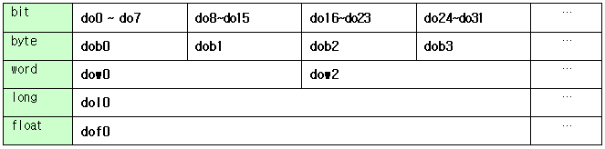

# 6.1.1 输入/输出变量

<table>
<thead>
  <tr>
    <td colspan="3"></td>
    <td>类型</td>
    <td>值范围</td>
  </tr>
</thead>
<tbody> 
  <tr>
    <td rowspan="10">fb0 ~ fb9</td>
    <td rowspan="5">数字输出</td>
    <td>do[0~959]  
    dob[0~119].x[0~7]  
    dow[0~118].x[0~15]  
    dol[0~116].x[0~31] </td>
    <td>位</td>
    <td>0, 1</td>
  </tr>
  <tr>
    <td>dob[0~119]</td>
    <td>有符号 1字节整数</td>
    <td>-128 ~ +127</td>
  </tr>
  <tr>
    <td>dow[0~118]</td>
    <td>有符号 2字节整数</td>
    <td>-32768 ~ +32767</td>
  </tr>
  <tr>
    <td>dol[0~116]</td>
    <td>有符号 4字节整数</td>
    <td>-2147483648 ~ +2147483647</td>
  </tr>
  <tr>
    <td>dof[0~116]</td>
    <td>有符号 4字节实数</td>
    <td>3.4E+/-38 (7 位有效数字)</td>
  </tr>
  <tr>
    <td rowspan="5">数字输入</td>
    <td>di[0~959]  
    dob[0~119].x[0~7]  
    dow[0~118].x[0~15]  
    dol[0~116].x[0~31] </td>
    <td>位</td>
    <td>0, 1</td>
  </tr>
  <tr>
    <td>dib[0~119]</td>
    <td>带符号 1字节 整数</td>
    <td>-128 ~ +127</td>
  </tr>
  <tr>
    <td>diw[0~118]</td>
    <td>带符号 2字节 整数</td>
    <td>-32768 ~ +32767</td>
  </tr>
  <tr>
    <td>dil[0~116]</td>
    <td>带符号 4字节 整数</td>
    <td>-2147483648 ~ +2147483647</td>
  </tr>
  <tr>
    <td>dif[0~116]</td>
    <td>带符号 4字节 实数</td>
    <td>3.4E+/-38 (7 个有效数字)</td>
  </tr>
</tbody>
</table>

  

在 `do`、`dob`、`dow`、`dol` 和 `dof` 中，后缀 `b`、`w`、`l` 和 `字母f (f)` 分别表示 `字节`、`字`、`长` 和 `浮动 (float)`，且均为带符号值。这些不是单独的内存空间，而是代表同一个 960 字节的空间，只是数据类型不同。例如，`do[1~16]`、`dob[1~2]` 和 `dow[1]` 都是相同的输出信号。

如果将值分配给以 `do` 开头的输出变量，则将执行 I/O 信号输出。可以通过读取以 `di` 开头的输入变量值来获取当前输入的 I/O 信号。`do` 变量可以被读写，但 `di` 变量只能被读取。

`FB` 对象名称可以省略，如下所示。

| **对象名称** | **do 记法** | fb.do 记法 |
| :--- | :--- | :--- |
| fb0 | do0 ~ do959 | fb0.do0 ~ fb0.do959 |
| fb1 | do960 ~ do1919 | fb1.do0 ~ fb1.do959 |
| fb2 | do1920 ~ do2879 | fb2.do0 ~ fb2.do959 |
| fb3 | do2880 ~ do3839 | fb3.do0 ~ fb3.do959 |
| fb4 | do3840 ~ do4799 | fb4.do0 ~ fb4.do959 |
| fb5 | do4800 ~ do5759 | fb5.do0 ~ fb5.do959 |
| fb6 | do5760 ~ do6719 | fb6.do0 ~ fb6.do959 |
| fb7 | do6720 ~ do7679 | fb7.do0 ~ fb7.do959 |
| fb8 | do7680 ~ do8639 | fb8.do0 ~ fb8.do959 |
| fb9 | do8640 ~ do9599 | fb9.do0 ~ fb9.do959 |