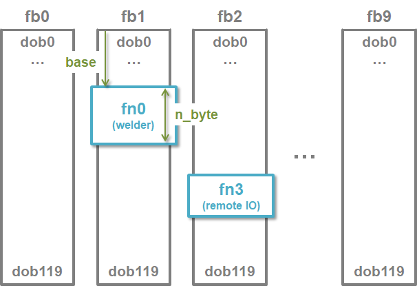

# 6.1.3 fn object

You can define fn objects by specifying specific areas of fb objects.
If the Hi6 controller is a fieldbus master, and there are multiple fieldbus slave devices, you can set the areas of each slave device to each fn object to handle these slaves intuitively.



See the link below for instructions on how to set up the fn region.

[Operation manual: fn block allocation](https://hrbook-hrc.web.app/#/view/doc-hi6-operation/english-tp630/7-setting/3-control-parameter/2-io-signal-setting/12-fn-block)
  
&nbsp;

The syntax of fn is the same format as fb.
The fn index is 0 to 63, and the bit index is 0 to 959, just like the fb.
That is, the maximum configurable index is fn0.do0 to fn63.do959.

An error occurs when accessing an unconfigured non-existent fn object or when accessing a do/di that exceeds the set range of fn.

See the use cases below;


```python
fn2.dob3=0b00001111  	# Set the fn2's output byte 3 as a binary bits
fn[4].dob1=0x0F  	# Turns on the fn4's output byte 1's lower 4 bits, and turns off the upper 4 bits.
var work_no=fn63.dib3    # Assign fn63's input byte 3 to the work_no variable
if fn5.di43 then *err  	# Branch to *err label when fn5.di42 is on.
for idx=21 to 29
  fn3.do[idx]=1  	# Turn on all of fn3's output signal do21 ~ do29.
next
fn2.do3=fn2.do7=fn2.do11=1   # Turn on the fn2's output signals 3, 7, and 11 at once.
```
