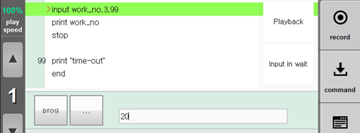

# 6.3.2 `input`

### Description

使用 `input` 语句将字符串作为 Teach Pendant 的按键输入，并将其存储在一个变量中。如果在超时之前没有输入，请继续执行以下语句或跳转到超时地址。

### Syntax

```python
input <variable>;[,<timeout>,<timeout address>]
```

### Parameter

<table>
  <thead>
    <tr>
      <th style="text-align:left">Parameter</th>
      <th style="text-align:left">Description</th>
      <th style="text-align:left">Remarks</th>
    </tr>
  </thead>
  <tbody>
    <tr>
      <td style="text-align:left">variable</td>
      <td style="text-align:left">
        <p>接收输入的变量。数字也作为字符串类型输入。如果需要数值，请转换为 int( ) 或 double( ) 函数。
      </td>
      <td style="text-align:left"></td>
    </tr>
    <tr>
      <td style="text-align:left">timeout</td>
      <td style="text-align:left">最大时间限制</td>
      <td style="text-align:left">0.1~60.0 秒
        <br />
      </td>
    </tr>
    <tr>
      <td style="text-align:left">timeout address</td>
      <td style="text-align:left">超时后跳转的地址</td>
      <td style="text-align:left">address</td>
    </tr>
  </tbody>
</table>

### Example

```python
input work_no
input work_no,10
input work_no,10,*timeout
```

