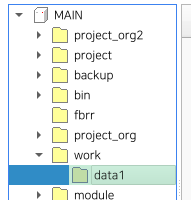

# 9.1.1 `mkdir`

`mkdir` 是创建目录的过程。

### 描述

在MAIN模块中为指定路径创建一个目录。

- 您不能在教学挂件或USB内存上创建目录。
- 如果中间路径的目录不存在，则会创建中间路径。

### 语法

```python
mkdir <path>
```

### 参数

<table>
  <thead>
    <tr>
      <th style="text-align:left">参数</th>
      <th style="text-align:left">描述</th>
      <th style="text-align:left">备注</th>
    </tr>
  </thead>
  <tbody>
    <tr>
      <td style="text-align:left">path</td>
      <td style="text-align:left">
        要创建的目录路径。<br>
        开头不要加 /。
      </td>
      <td style="text-align:left">字符串表达式</td>
    </tr>
  </tbody>
</table>

### 示例

```python
mkdir "work/data1"
```

