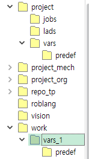

# 9.1.2 copyfile문

copyfile문은 디렉토리나 파일의 복사를 요청하는 프로시져입니다.

### 설명

지정한 원본 경로의 디렉토리, 혹은 파일을 지정한 대상 경로파일명으로 복사합니다.   

- 티치펜던트나 USB 메모리가 아닌 MAIN 모듈 내에서만 수행할 수 있습니다.
- 대상 경로파일명의 중간 경로의 디렉토리가 존재하지 않으면, 중간 경로까지 만들어줍니다.
- 대상 디렉토리나 파일이 이미 존재하면 overwrite 합니다.
- 디렉토리의 서브 디렉토리들도 모두 복사됩니다.
- wildcard는 지원하지 않습니다.

- 용량이 큰 파일이나 디렉토리 전체가 복사될 수도 있기 때문에, 복사 중 대기에 의한 택트 타임 손실이 없도록 백그라운드에서 비동기적으로 수행됩니다. 즉, copyfile 명령문이 수행되면 백그라운드 작업에서 복사를 시작하면서 즉각 다음 명령문의 수행을 진행합니다. 가령, 복사를 요청해놓고 move문들을 실행할 수 있습니다. 복사가 성공적으로 완료 되었는지는 결과변수의 값을 읽어 확인 할 수 있습니다.
- 하나의 복사나 삭제가 끝나기 전에는 다른 복사나 삭제를 요청할 수 없습니다.


### 문법

```python
copyfile <결과변수>,<원본 경로파일명>,<대상 경로파일명>
```

### 파라미터

<table>
  <thead>
    <tr>
      <th style="text-align:left">항목</th>
      <th style="text-align:left">의미</th>
      <th style="text-align:left">기타</th>
    </tr>
  </thead>
  <tbody>
  <tr>
      <td style="text-align:left">결과변수</td>
      <td style="text-align:left">
        백그라운드 수행 결과<br>
        <ul>
        <li>1: 성공적으로 완료됨.</li>
        <li>0: 복사 진행 중.</li>
        <li>-1: 유효하지 않은 원본 경로파일명.</li>
        <li>-2: 디렉토리 복사 중 임시경로 클리어 실패.</li>
        <li>-3: 디렉토리 복사 중 기존 대상경로 클리어 실패.</li>
        <li>-4: 디렉토리 복사 중 임시경로에서 대상경로로의 이동 실패.</li>
        <li>-11: 파일 복사 실패.</li>
        </ul>
      </td>
      <td style="text-align:left">변수</td>
    </tr>
    <tr>
      <td style="text-align:left">원본 경로파일명</td>
      <td style="text-align:left">
        복사할 디렉토리 경로,<br>
        혹은 복사할 파일의 경로파일명
      </td>
      <td style="text-align:left">문자열식</td>
    </tr>
    <tr>
      <td style="text-align:left">대상 경로파일명</td>
      <td style="text-align:left">
        복사에 의해 만들어질 디렉토리 경로,<br>
        혹은 복사에 의해 만들어질 파일의 경로파일명
      </td>
      <td style="text-align:left">문자열식</td>
    </tr>
  </tbody>
</table>

### 사용 예

```python
   var res
   copyfile res,"project/vars","work/vars_1"
   wait res==1,8,*timeout
   copyfile res,"work/sub5.job","project/jobs/0005_sub.job"
   wait res==1,4,*timeout
   call 5
   end
   *timeout
   print "copyfile failed"
   end
```



