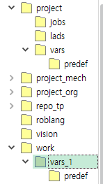

# 9.1.2 `copyfile`

A `copyfile` 是请求复制目录或文件的程序。

### Description

将指定源路径的目录或文件复制到指定的目标路径名称。

- 只能在 MAIN 模块内执行，不能在 Teach Pendant 或 USB 存储器中执行。
- 如果目标路径名称的中间路径不存在，则会创建中间路径。
- 如果目标目录已存在，则删除它并复制源目录。
- 如果目标文件已存在，则覆盖它。
- 目录中的所有子目录也将被复制。
- 目标路径名称也支持通配符 ('*', '?')。

- 因为可能会复制大型文件或整个目录，因此它在后台异步执行，以避免因复制时等待而导致的节拍时间损失。换句话说，当执行 `copyfile` 语句时，启动后台任务中的复制，立刻继续执行下一个语句。例如，您可以请求复制并执行移动语句。可以通过读取结果变量的值来确定复制是否成功完成。（也就是说，当复制失败时，不会生成错误或警告。）

- 在一项复制或删除完成之前，您无法请求另一项复制或删除。

### Syntax

```python
copyfile <result-variable>,<source pathname>,<destination pathname>
```

### Parameters

<table>
  <thead>
    <tr>
      <th style="text-align:left">Parameter</th>
      <th style="text-align:left">Description</th>
      <th style="text-align:left">Remarks</th>
    </tr>
  </thead>
  <tbody>
  <tr>
      <td style="text-align:left">result-variable</td>
      <td style="text-align:left">
        背景执行的结果<br>
        <ul>
        <li>1: 成功完成。</li>
        <li>0: 复制进行中。</li>
        <li>-1: 源路径名称无效。</li>
        <li>-2: 目标路径名称无效。</li>
        <li>-3: 复制失败。</li>
        <li>-6: 复制通配符时全部失败。</li>
        <li>-7: 复制通配符时部分失败。</li>
        <li>-11: 创建临时路径失败。</li>
        <li>-12: 复制到临时路径失败。</li>
        <li>-13: 清除现有目标路径失败。</li>
        <li>-14: 目标路径创建失败。</li>
        <li>-15: 从临时路径移动到目标路径失败。</li>
        </ul>
      </td>
      <td style="text-align:left">variable</td>
    </tr>
    <tr>
      <td style="text-align:left">source pathname</td>
      <td style="text-align:left">
        要复制的目录路径,<br>
        或要复制的文件路径名称
      </td>
      <td style="text-align:left">string expression</td>
    </tr>
    <tr>
      <td style="text-align:left">string expression</td>
      <td style="text-align:left">
        - 以 '/' 结尾：要复制的路径。<br>
        - 不以 '/' 结尾：通过复制将创建的路径名称。
      </td>
      <td style="text-align:left">string expression</td>
    </tr>
  </tbody>
</table>

### Sample

```python
   var res
   copyfile res,"project/vars","work/vars_1" # vars_1/ 文件夹被创建。
   wait res==1,8,*timeout
   copyfile res,"project/vars","work/vars_1/" # vars_1/vars/ 文件夹被创建。
   wait res==1,8,*timeout
   copyfile res,"work/clear.job","project/jobs/0005_clear.job"
   wait res==1,4,*timeout
   copyfile res,"work/*_sub.job","project/jobs/" # 通配符
   wait res==1,4,*timeout
   call 5
   end
   *timeout
   print "copyfile 失败"
   end
```

