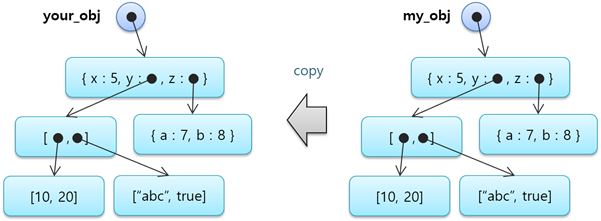

# 4.3 배열과 객체의 복사 대입\(assignment\)

대입문 우변이 배열이나 객체 변수인 경우, 변수의 값 전체가 좌변의 변수로 복사됩니다. 배열이나 객체가 요소값으로서 서브 배열과 서브 객체들을 복잡하게 포함하고 있을 때에도, 이러한 포함 구조들이 모두 복사되는데 이를 깊은 복사\(deep copy\)라고 합니다.

<table>
  <thead>
    <tr>
      <th style="text-align:left"></th>
      <th style="text-align:left"></th>
    </tr>
  </thead>
  <tbody>
    <tr>
      <td style="text-align:left">0001.job</td>
      <td style="text-align:left">
        
var my_obj = { x:5, y:0, z:0 }
           
        

        
my_obj.y=[ [10, 20], [&quot;abc&quot;, true] ]
           
        

        
my_obj.z={ a:7, b:8 }
           
        

        
var your_obj=my_obj # deep copy
           
        

        
print your_obj.y[0]
           
        

      </td>
    </tr>
    <tr>
      <td style="text-align:left">결과</td>
      <td style="text-align:left">[10, 20]</td>
    </tr>
  </tbody>
</table>

