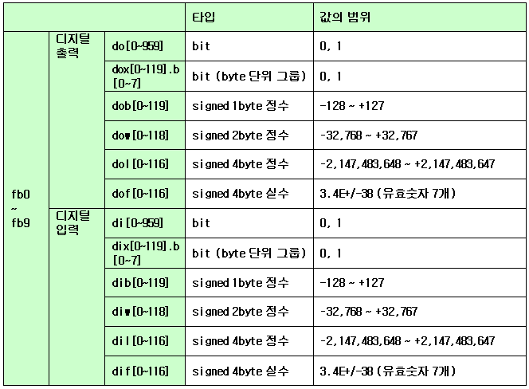

# 4.3 Copied assignment of arrays and objects

If the right side of an assignment statement has object variables, the entire values of the variables will be copied to the variables of the left side. When an array or an object includes sub-arrays and sub-objects in a complex manner as element values, such inclusion structures will be copied, which is called a deep copy.

<table>
  <thead>
    <tr>
      <th style="text-align:left"></th>
      <th style="text-align:left"></th>
    </tr>
  </thead>
  <tbody>
    <tr>
      <td style="text-align:left">0001.job</td>
      <td style="text-align:left">
        
var my_obj = { x:5, y:0, z:0 }
           
        

        
my_obj.y=[ [10, 20], [&quot;abc&quot;, true] ]
           
        

        
my_obj.z={ a:7, b:8 }
           
        

        
var your_obj=my_obj # deep copy
           
        

        
print your_obj.y[0]
           
        

      </td>
    </tr>
    <tr>
      <td style="text-align:left">Result</td>
      <td style="text-align:left">[10, 20]</td>
    </tr>
  </tbody>
</table>

